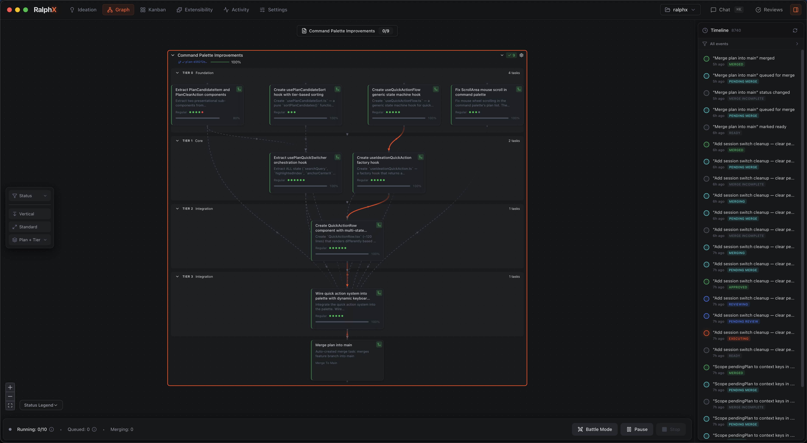

<h1 align="center">
  <br>
  RalphX
  <br>
</h1>

<p align="center">
  <strong>The control room for autonomous AI development.</strong>
  <br>
  A native macOS app that orchestrates AI agents through a visual interface — <br>
  so you manage intent, not terminals.
</p>

<p align="center">
  <a href="#what-it-is">What It Is</a> &middot;
  <a href="#the-gap">The Gap</a> &middot;
  <a href="#screenshots">Screenshots</a> &middot;
  <a href="#how-it-works">How It Works</a> &middot;
  <a href="#key-features">Features</a> &middot;
  <a href="#who-its-for">Who It's For</a> &middot;
  <a href="#getting-started">Get Started</a> &middot;
  <a href="#documentation">Docs</a>
</p>

---

<p align="center">
  
</p>

---

## What It Is

RalphX is a native macOS desktop application that serves as a control room for autonomous AI-driven software development. It orchestrates a fleet of 20 specialized Claude AI agents through a visual Kanban interface backed by a 14-state task lifecycle engine. You describe what you want, drag a task to Planned, and watch it execute — from code generation through review, QA, and merge.

All data stays on your machine. Local SQLite database. No cloud. No telemetry. Every agent action is logged, scoped, and reversible. The entire system is open source.

## The Gap

You're already running AI agents. You're managing them with terminal tabs and shell scripts. RalphX makes that systematic.

| | Terminal Tabs | RalphX |
|---|---|---|
| **Visibility** | Tail logs across 5 terminals | Unified Kanban with live activity stream |
| **Coordination** | Copy-paste context between sessions | Agents share context through structured handoffs |
| **Review** | Hope the AI didn't break anything | Automated review gates with human checkpoints |
| **Git safety** | AI commits to your working branch | Isolated git worktrees. AI never touches your code. |
| **Audit trail** | Scroll through terminal history | Every state transition logged with timestamps and agent IDs |
| **Scale** | One task per terminal, one terminal per monitor | 10 concurrent tasks, one Kanban board |

## Screenshots

<table>
  <tr>
    <td width="50%">
      
      <p><strong>Ideation Studio</strong> — Describe what you want in natural language. Choose Solo, Research Team, or Debate Team mode. Get task proposals with dependencies, complexity estimates, and acceptance criteria. Apply to Kanban with one click.</p>
    </td>
    <td width="50%">
      
      <p><strong>Merge Pipeline</strong> — 10-step automated merge validation: preparation, preconditions, branch freshness, worktree setup, cleanup, merge, type check, lint, clippy, tests. The Merger agent resolves conflicts and reports results in real time.</p>
    </td>
  </tr>
</table>

## How It Works

RalphX runs a structured agent pipeline for every task. You provide intent. Agents handle execution.

```
 You
  |
  v
+-----------+
| Ideation  |  Describe what you want
| Studio    |  --> task proposals with dependencies
+-----+-----+
      |
      v
+-----------+
|  Kanban   |  Drag task to Planned
|  Board    |  --> execution begins automatically
+-----+-----+
      |
      v
+-----------+  Writes code in isolated worktree
|  Worker   |  Scoped tools: file read/write, shell
|  Agent    |  Cannot approve its own code
+-----+-----+
      |
      v
+-----------+  Reviews diffs, files structured issues
| Reviewer  |  Scoped tools: read-only + complete_review
|  Agent    |  Max 3 auto-fix cycles before human escalation
+-----+-----+
      |
      v
+-----------+  Merges to main, runs full validation
|  Merger   |  Type check --> lint --> clippy --> tests
|  Agent    |  Reports conflicts, never forces
+-----+-----+
      |
      v
+-----------+  Detects loops, stalls, resource waste
|Supervisor |  Kills stuck agents, escalates to human
| Watchdog  |  Always running, always watching
+-----------+
```

Every agent has **principle-of-least-privilege** tool access enforced at three independent layers: Rust spawn config, MCP server filter, and agent system prompt. A reviewer cannot write files. A worker cannot approve its own code. A merger cannot skip conflict reporting.

## Key Features

### Kanban + Auto-Execution

A visual board where columns map to lifecycle states. Drag a task to **Planned** — a Worker agent picks it up, writes code in an isolated worktree, and pushes it through the full pipeline. No configuration required. The Kanban board is the interface; the agents are the engine.

### 14-State Task Lifecycle

Every task moves through a structured lifecycle enforced by a compile-time state machine (built with `statig` in Rust). Invalid transitions don't compile — they're caught at build time, not runtime. States include Draft, Proposed, Planned, Executing, Reviewing, QA Testing, Merging, Done, and more. Every transition is logged with timestamps, agent IDs, and outcomes.

### Ideation System

Press `Cmd+K`. Describe what you want to build. The Orchestrator agent generates task proposals with dependency graphs, complexity estimates, acceptance criteria, and suggested execution order. Choose **Solo** mode for quick tasks, **Research Team** for investigation, or **Debate Team** for architectural decisions. Apply proposals to the Kanban board with one click.

### Review Gates

AI-generated code never ships unreviewed. The pipeline enforces:
1. **AI Review** — Reviewer agent examines diffs, files structured issues with severity levels
2. **Human Checkpoint** — Escalation point for complex changes. You decide what ships.
3. **QA Testing** — Automated test execution with browser verification
4. **Auto-fix limit** — Max 3 attempts. If the Worker can't resolve review issues in 3 cycles, it stops and asks for help.

### Git Worktree Isolation

Every project gets its own git worktree. AI agents commit, branch, and merge in isolation — your working branch is never touched. Review diffs before anything reaches main. If something goes wrong, the worktree is disposable. Your code is safe.

### Supervisor Watchdog

A background agent monitors all running tasks. Detects execution loops (agent stuck in a cycle), stalled tasks (no activity for configurable timeout), and resource waste (running too long without meaningful output). When it detects a problem, it kills the stuck agent and escalates to you. No more checking terminal tabs to see if Claude is still thinking.

## Tech Stack

| Layer | Technology | Why |
|---|---|---|
| **Desktop** | Tauri 2.0 | 10MB bundle, ~30MB RAM. Native performance without Electron. |
| **Backend** | Rust | Memory-safe. No buffer overflows, no use-after-free. Compile-time guarantees. |
| **Frontend** | React 19 + TypeScript | Strict types. Responsive Kanban, graph view, real-time activity stream. |
| **Database** | SQLite (local) | Zero deployment. No server. Data never leaves your machine. |
| **AI** | Claude via MCP | 20 specialized agents with three-tier tool scoping. |
| **State Machine** | statig (Rust) | Compile-time state verification. Invalid transitions won't build. |
| **Git** | Worktree isolation | Parallel execution. AI never touches your working branch. |

## Who It's For

### Individual Developers

**Senior Software Engineer** — You're running 3+ Claude sessions in terminal tabs, copy-pasting context, manually managing worktrees. You spend more time managing Claude than writing code. RalphX gives you one board, live visibility into every agent, and review diffs before merge. You write intent, not boilerplate.

**Solopreneur** — Building a product alone. AI agents are your entire engineering team. You need maximum output from minimum oversight. RalphX turns "describe what I want" into shipped features — with review gates that catch the bugs you'd miss at 2 AM on your third feature of the night.

**Vibe Coder** — You build by describing what you want. Maybe you're a designer, PM, or domain expert who codes through AI. You need guardrails more than anyone because you can't always evaluate output technically. The 14-state lifecycle and review gates protect you from shipping broken code. The AI reviews the AI — and escalates to you when it matters.

### Team Leads

**Staff / Principal Engineer** — Force multiplier responsible for architecture across teams. The plugin system lets you encode architectural standards as agent methodology — review criteria, coding patterns, testing requirements. Every AI-generated PR follows your team's practices automatically.

**Tech Lead** — You're the review bottleneck. Your team's AI output exceeds your review capacity. Review gates filter 80% of issues before your eyes touch the code. You review what matters, not what a linter could catch.

### Organization Leaders

**Engineering Manager** — You need visibility into AI-assisted development without micromanaging it. The activity stream and state machine give you a real-time dashboard: what's executing, what's blocked, what shipped. Justified by throughput per engineer.

**Director of Engineering** — Standardizing AI development practices across teams. One methodology configuration, enforced across every project. The audit trail satisfies your security team. Open source means they audit the actual code.

### Enterprise

**VP Engineering** — Presenting AI ROI to the board. RalphX turns "we're experimenting with AI coding" into "we have a structured, auditable AI development pipeline." Ship the roadmap of a 10-person team with current headcount.

**CTO** — Strategic bet on AI-augmented development. Local-first (data sovereignty). Open source (no vendor lock-in). Rust backend (memory-safe). Compile-time state verification. Your security team can audit it in weeks, not months.

### Honestly, Not For You If:

- You're on Linux or Windows (macOS only, for now)
- You prefer cloud-hosted AI dev platforms (RalphX is local-first by design)
- You need multi-user real-time collaboration (single-developer orchestration today)
- You don't use Claude (RalphX orchestrates Claude agents specifically)
- You want code autocomplete (that's Copilot / Cursor — RalphX orchestrates outside the IDE)

## Getting Started

### Prerequisites

- macOS 13+ (Ventura or later)
- [Claude CLI](https://docs.anthropic.com/en/docs/claude-code) installed and authenticated
- Git 2.20+
- Node.js 20+ and npm
- Rust toolchain (for building from source)

### Install

```bash
# Clone the repository
git clone https://github.com/nicholasgriffintn/ralphx.git
cd ralphx

# Install frontend dependencies
npm install

# Build and run
npm run tauri dev
```

### First Task in 60 Seconds

1. **Create a project** — Click "New Project", point it at a git repository
2. **Open Ideation** — Press `Cmd+K`, describe what you want to build
3. **Apply proposals** — Review the generated tasks, apply to Kanban
4. **Execute** — Drag a task to **Planned**. Watch it run.

The Worker agent writes code in an isolated worktree, the Reviewer examines the diff, QA runs tests, and the Merger lands it on main. You intervene when the review gate escalates. Otherwise, it ships.

## Documentation

| Guide | Description |
|---|---|
| [Getting Started](docs/user-guides/getting-started.md) | Installation, first project, first task execution |
| [Kanban Board](docs/user-guides/kanban.md) | Board layout, task cards, drag-to-execute, filtering |
| [Graph View](docs/user-guides/graph-view.md) | Dependency visualization, critical path, execution flow |
| [Agent Orchestration](docs/user-guides/agent-orchestration.md) | 20 agents, roles, permissions, the execution pipeline |
| [Task Execution](docs/user-guides/execution.md) | Worker agent lifecycle, monitoring, intervention points |
| [Merge Pipeline](docs/user-guides/merge.md) | 10-step merge validation, conflict resolution, rollback |
| [Ideation Studio](docs/user-guides/ideation-studio.md) | Natural language to task proposals, team modes |
| [Task State Machine](docs/user-guides/task-state-machine.md) | 14 states, valid transitions, audit trail |
| [Configuration](docs/user-guides/configuration.md) | Project settings, agent tuning, methodology plugins |

## Roadmap

| Phase | Focus | Status |
|---|---|---|
| **Core Engine** | State machine, Kanban, agent orchestration, git worktree isolation | Complete |
| **Review System** | AI review, human checkpoints, QA gates, auto-fix cycles | Complete |
| **Ideation** | Natural language to task proposals, Solo / Research / Debate modes | Complete |
| **Merge Pipeline** | 10-step validation, conflict resolution, branch management | Complete |
| **Graph View** | Dependency visualization, critical path, execution status overlay | Complete |
| **Plugin System** | Custom agents, methodologies, workflow extensions | In Progress |
| **Memory System** | Cross-session knowledge, semantic search, institutional learning | Planned |
| **Multi-Model** | Model-agnostic routing, cost optimization per agent role | Planned |

## Built By What It Builds

RalphX is developed autonomously using the loop it implements. Tasks are described in Ideation, planned on the Kanban board, executed by Worker agents, reviewed by Reviewer agents, and merged through the pipeline. The tool builds itself.

---

<p align="center">
  <strong>RalphX</strong> — The control room for autonomous AI development.
  <br>
  <sub>Open source. Local-first. Auditable.</sub>
  <br><br>
  <a href="#getting-started">Get Started</a> &middot;
  <a href="#documentation">Documentation</a>
</p>
