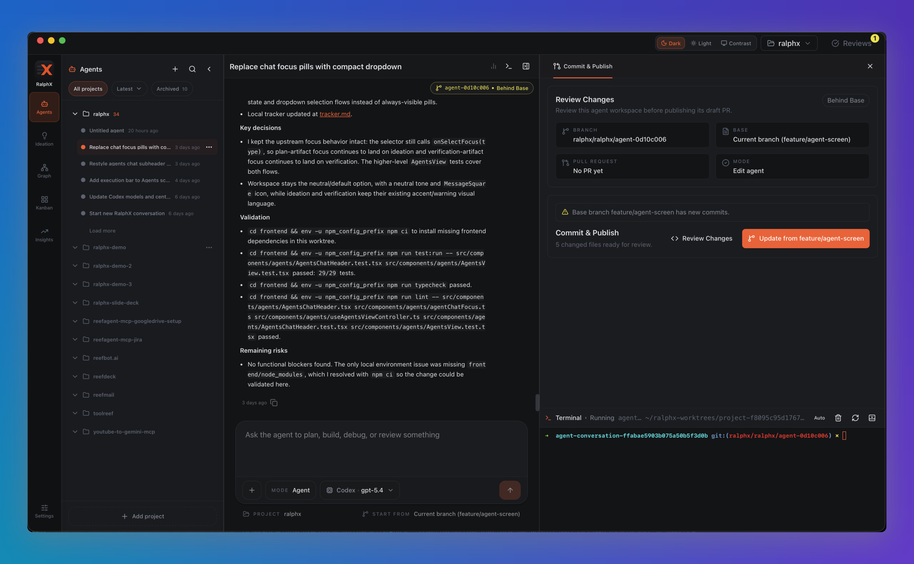

<p align="center">
  
</p>

<p align="center">
  <strong>The best way to ship software with AI.</strong>
  <br>
  <sub>The AI development infrastructure you own. Open source. Local-first. Yours.</sub>
</p>

<p align="center">
  <a href="#what-it-is">What It Is</a> ·
  <a href="#what-changes-day-to-day">What Changes</a> ·
  <a href="#how-it-works">How It Works</a> ·
  <a href="https://ralphx.app">Website</a> ·
  <a href="#getting-started">Get Started</a> ·
  <a href="#who-its-for">Who It's For</a>
</p>

<p align="center">
  <a href="https://github.com/aigentive/ralphx.app/releases">
    
  </a>
  <a href="https://codecov.io/github/aigentive/ralphx.app">
    
  </a>
</p>

<p align="center">
  <a href="https://codecov.io/github/aigentive/ralphx.app">
    
  </a>
  <a href="https://codecov.io/github/aigentive/ralphx.app">
    
  </a>
  <a href="https://codecov.io/github/aigentive/ralphx.app">
    
  </a>
  <a href="https://codecov.io/github/aigentive/ralphx.app">
    
  </a>
  <a href="https://codecov.io/github/aigentive/ralphx.app">
    
  </a>
</p>

---

## What It Is

RalphX is a local Mac desktop app for AI development work.

It organizes your AI coding agents by project, keeps their conversations persistent and searchable, gives each agent an isolated workspace, and manages the git, review, merge, and PR flow around the code they produce.

RalphX has no hosted backend. Project state and orchestration data live locally in SQLite. The AI runtimes you configure still receive the context needed to do their work, but RalphX owns the workflow around that work: projects, conversations, tasks, workspaces, review gates, merge state, and history.

## The Daily Friction

If you already use Claude Code, Codex, or similar coding agents on real projects, the workflow often starts simple and then gets messy:

- one terminal tab per agent session
- hard-to-find or lost conversation history
- sessions that are awkward to continue later
- manual worktrees and branches
- manual commits, rebases, pushes, PR checks, and merge cleanup
- separate GitHub tabs for PR state
- separate task boards for planning
- separate logs, review notes, screenshots, and terminal output
- no single project view of what all agents are doing

RalphX turns that scattered workflow into one project-scoped desktop app.

The first practical win is the Agents view: your agent conversations are grouped by project, titled, searchable, archivable, restorable, and connected to provider session metadata so work can continue later when the harness supports it.

Before RalphX:

```text
Open terminal -> start Claude -> remember which tab is which -> keep terminal alive -> manually recover later.
```

With RalphX:

```text
Open project -> pick the agent conversation -> continue where the work lives.
```

## What Changes Day To Day

RalphX does not need to replace your editor, git provider, or AI model. It changes how you use them.

Some tools stay underneath it. You just stop managing all of them manually all day.

| Existing tool or habit | What changes with RalphX |
|---|---|
| Terminal tabs for AI agents | Agent conversations become project-scoped, persistent, searchable, and resumable |
| Manual Claude/Codex session management | RalphX starts, tracks, attributes, and can continue runs when provider session lineage is available |
| Manual git worktrees | RalphX creates isolated task workspaces for agents |
| Manual branches | RalphX creates task branches and plan branches |
| Manual commits | RalphX can commit agent output after execution |
| Manual rebases / merges | RalphX runs the configured merge strategy |
| GitHub PR tab watching | RalphX can open and monitor plan PRs in GitHub PR mode |
| Ad hoc AI code review | RalphX routes output through reviewer agents and human approval gates |
| Kanban/task board | RalphX's board is tied directly to execution state, not just status labels |
| Manually tracking what blocks what | RalphX Graph shows task dependencies, tiers, critical path, and parallelizable work |
| Log tailing | Activity, chat, and task detail views show what happened and why |

## How It Works

RalphX starts with normal development primitives: projects, agents, workspaces, git, terminal, and UI.

Then it adds an opinionated delivery pipeline around them.

### 1. Agents Are Organized By Project

The Agents view gives you a project-scoped place for AI conversations. Conversations persist after the terminal process exits, can be searched later, and can be tied to a workspace and terminal when the agent needs to inspect or change files.

This is the day-one workflow improvement: stop treating every agent run like a disposable terminal tab.

### 2. Agents Work In Isolated Git Workspaces

When code needs to be changed, RalphX creates isolated git worktrees and task branches. Agents do not edit your main checkout or staged local work.

If a task fails, the workspace can be preserved for inspection. If it succeeds, RalphX can commit the output and move it through review and merge.

### 3. Work Moves Through Reviewable States

RalphX turns "ask AI to code" into a repeatable workflow:

```text
Ready -> Executing -> Reviewing -> Review Passed -> Approved -> Merge -> Merged
```

Worker agents implement, reviewer agents inspect the diff, and you can approve or request changes before code lands.

### 4. Git, Merge, And PR Flow Are Managed

RalphX can create task branches, run validation commands, apply your merge strategy, clean up worktrees, and optionally create or monitor GitHub PRs for plan-level delivery.

You still own your repo. RalphX manages the repetitive git and PR workflow around agent-produced code.

## First Workflow

1. **Create a project** - Point RalphX at a git repository.
2. **Start an agent conversation** - Use the Agents view for project-scoped chat, debugging, planning, or implementation help.
3. **Use Ideation for larger work** - Describe the feature and let RalphX propose a plan and task breakdown.
4. **Review proposals** - Edit, accept, or reject the generated tasks before execution.
5. **Watch execution** - Tasks move through Kanban as agents implement, review, and merge.
6. **Approve code before merge** - Review findings and decide whether the task should land or go back for changes.

For simple work, you can start directly from an agent conversation or a task. For larger work, Ideation turns a brief into a task graph.

## Core Surfaces

| Surface | What it is for |
|---|---|
| **Agents** | Project-scoped agent conversations, persistent history, search, workspace/terminal access |
| **Ideation** | Turn a feature description into a plan, proposals, dependencies, and executable tasks |
| **Kanban** | Live task execution state: backlog, ready, executing, review, approval, merge, done |
| **Graph** | Plan dependencies, execution tiers, critical path, and timeline context |
| **Activity** | Audit trail of state changes, agent events, review, and merge activity |
| **Settings** | Repository settings, execution lanes, ideation lanes, harness/model controls, validation |

## Safety And Ownership

RalphX is designed around local ownership and reviewable AI-generated code.

- **Local-first state** - Project state and orchestration history live in local SQLite.
- **No hosted backend** - The desktop app runs locally.
- **Worktree isolation** - Agents work in isolated git worktrees instead of your main checkout.
- **Review gates** - Reviewer agents and human approval points sit between generated code and merge.
- **Explicit merge flow** - Validation, merge strategies, conflict handling, and PR mode are first-class.
- **Scoped agents** - Agent roles have different tools and responsibilities.
- **Provider-neutral direction** - Claude is the broadest default today; Codex can be selected per supported lane.

RalphX is not a replacement for your model, editor, or git provider. It is the local workflow layer that makes them work together.

## Getting Started

### Requirements

To run RalphX:

- macOS 13+ (Ventura or later)
- At least one supported agent runtime installed and authenticated:
  - [Claude CLI](https://docs.anthropic.com/en/docs/claude-code)
  - [Codex CLI](https://developers.openai.com/codex/cli)

To build from source:

- Node.js 18+ and npm
- Rust via [rustup.rs](https://rustup.rs); this repo pins its toolchain in `rust-toolchain.toml`
- Git

Harness controls are exposed in the desktop app:

- `Settings -> General -> Execution Agents` for worker, reviewer, re-executor, and merger lanes
- `Settings -> Ideation -> Ideation Agents` for ideation, verifier, and specialist lanes

### Install

Website:

- [ralphx.app](https://ralphx.app)

#### Homebrew

```bash
brew tap aigentive/ralphx
brew install --cask ralphx
```

Upgrade an existing Homebrew install:

```bash
brew update
brew upgrade --cask ralphx
```

If a new RalphX release exists but Homebrew still reports that `ralphx` is already up to date, refresh the tap metadata and retry:

```bash
brew update-reset aigentive/ralphx
brew upgrade --cask ralphx
```

If `/Applications/RalphX.app` was deleted manually and `brew upgrade --cask ralphx` fails with `App source '/Applications/RalphX.app' is not there`, repair the Homebrew cask receipt and reinstall:

```bash
brew uninstall --cask --force ralphx
brew install --cask ralphx
```

Do not use `--zap` unless you intentionally want to remove local RalphX app data.

#### GitHub Releases

Download signed builds from the [GitHub Releases page](https://github.com/aigentive/ralphx.app/releases).

#### Build From Source

```bash
git clone https://github.com/aigentive/ralphx.app.git ralphx.app
cd ralphx.app
cd frontend
npm install
npm run tauri dev
```

First build compiles the Rust backend. Subsequent starts are faster.
Source dev uses backend port `3857`, so it can run while the installed app keeps production port `3847`.

For a fresh native dev start from the repo root:

```bash
./dev-fresh
```

## Who It's For

**Developers using Claude/Codex on real repos** - Keep agent conversations persistent, searchable, project-scoped, and connected to actual workspaces.

**Solo builders** - Turn AI agents into a local engineering bench for planning, implementation, review, and merge.

**Team leads** - Make AI coding reviewable instead of invisible terminal activity.

**Staff+ engineers** - Encode practices through agents, settings, review gates, and workflow structure.

### Not For You Yet If

- You are on Linux or Windows. RalphX is macOS-only for now.
- You do not want to install an external agent runtime.
- You need fully offline AI execution.
- You need multi-user collaboration. RalphX Desktop is currently single-developer orchestration.

## Tech Stack

| Layer | Technology | Why |
|---|---|---|
| **Desktop** | Tauri 2.0 | Native macOS app shell without Electron |
| **Backend** | Rust | Memory-safe orchestration, state machine, git and process management |
| **Frontend** | React 19 + TypeScript | Responsive Agents, Kanban, Graph, Activity, and Settings views |
| **Database** | SQLite | Local project state and orchestration history |
| **AI runtime** | Claude + Codex via lane-based harnesses | Provider-aware orchestration with per-lane routing |
| **Git** | Worktrees and branches | Isolated agent workspaces and reviewable history |

## Origin

RalphX began as a shell script for orchestrating AI coding sessions and grew into a native macOS desktop app for planning, running, reviewing, and merging AI-assisted software work.

Built independently by [Laza Bogdan](https://www.linkedin.com/in/laza-bogdan/) and a fleet of AI agents.

The tool was built by the thing it builds.

## License

Apache 2.0. See [LICENSE](LICENSE).

Use it however you want. Build commercial products with it. Modify it. Distribute it. The patent grant means your legal team can approve it.

---

<p align="center">
  <strong>RalphX.app</strong> - The best way to ship software with AI.
  <br>
  <sub>Open source. Local-first. Yours.</sub>
  <br><br>
  <a href="#getting-started">Get Started</a>
</p>
