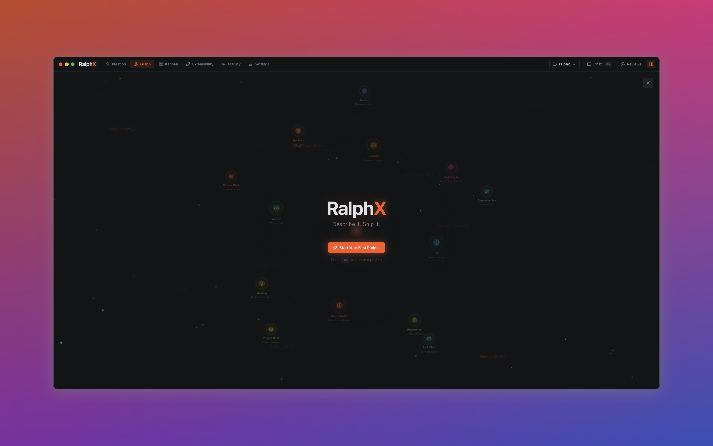
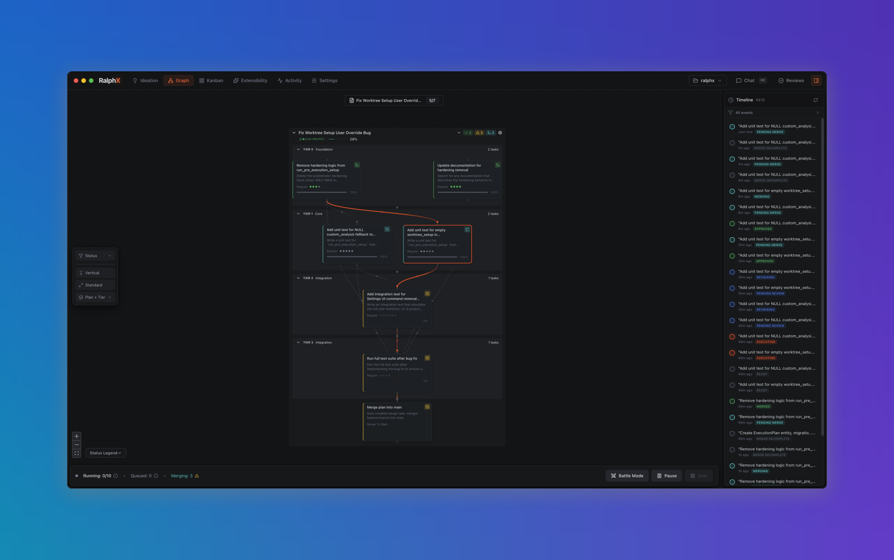
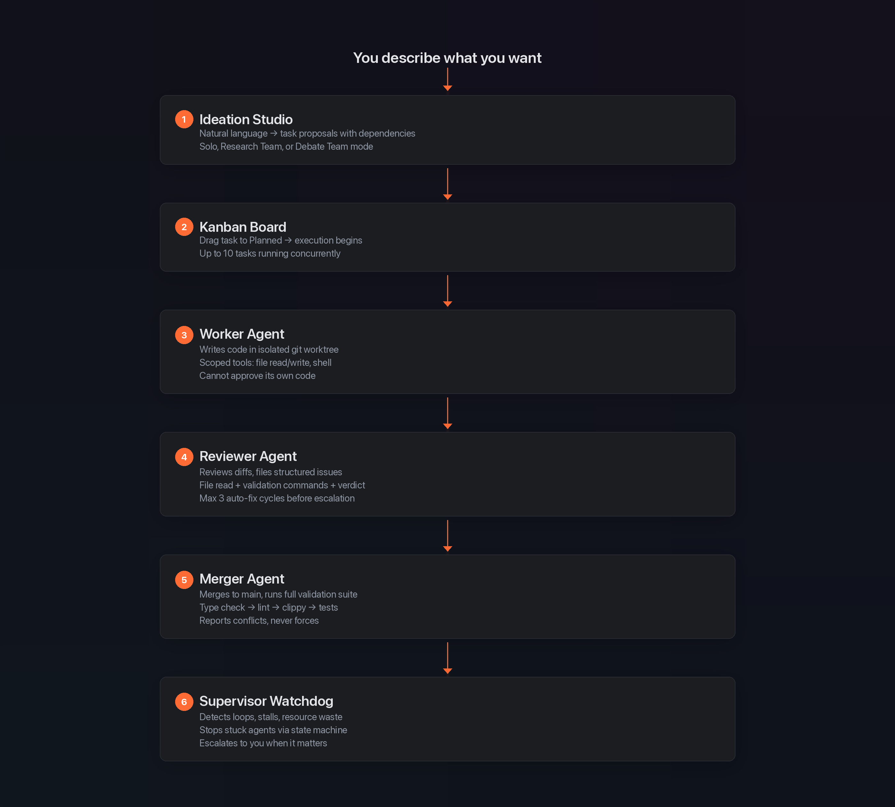
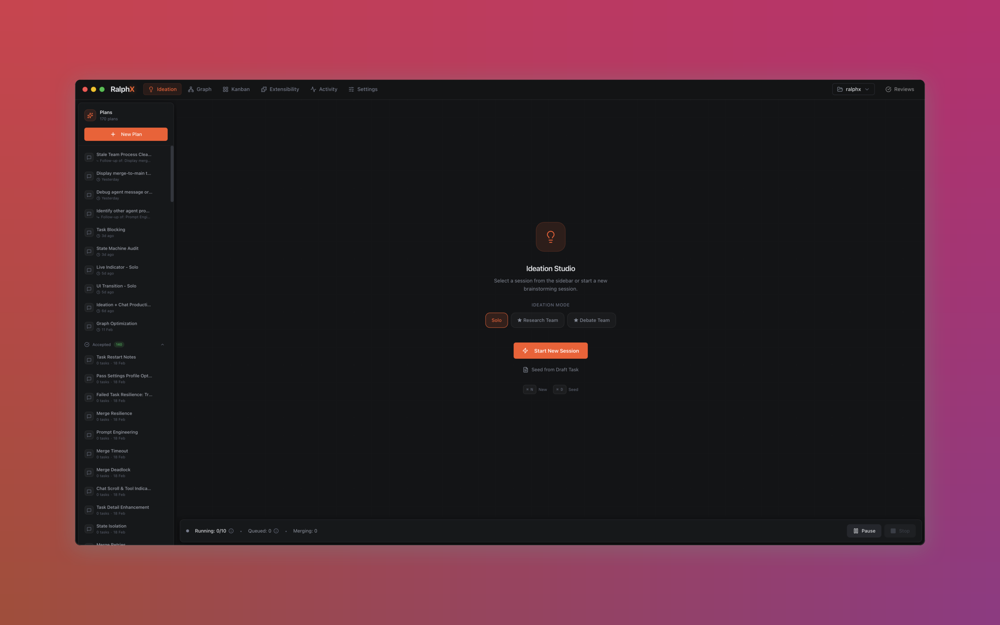
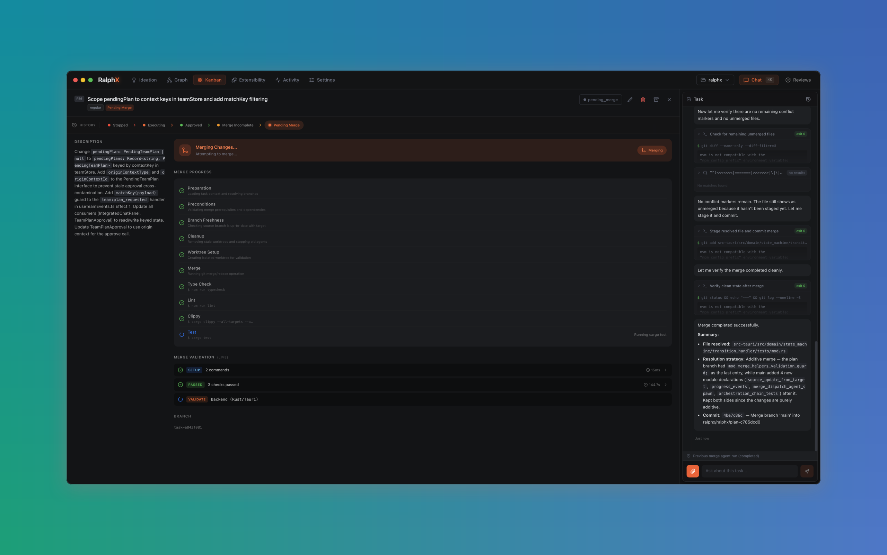
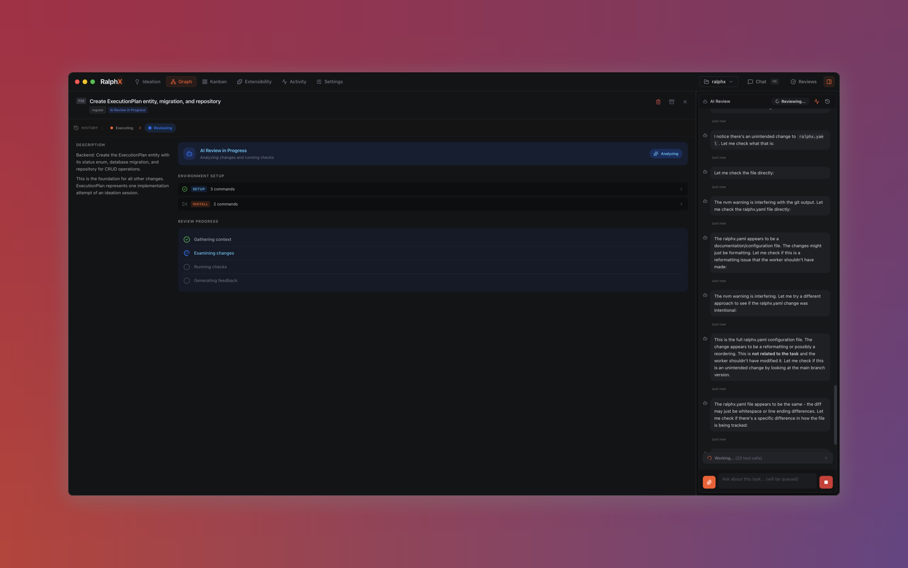
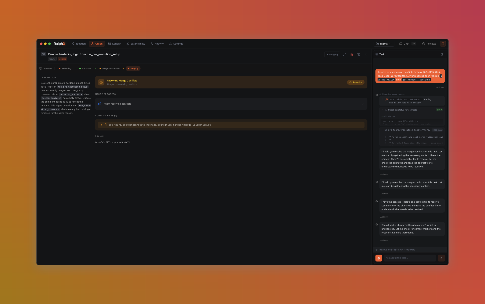
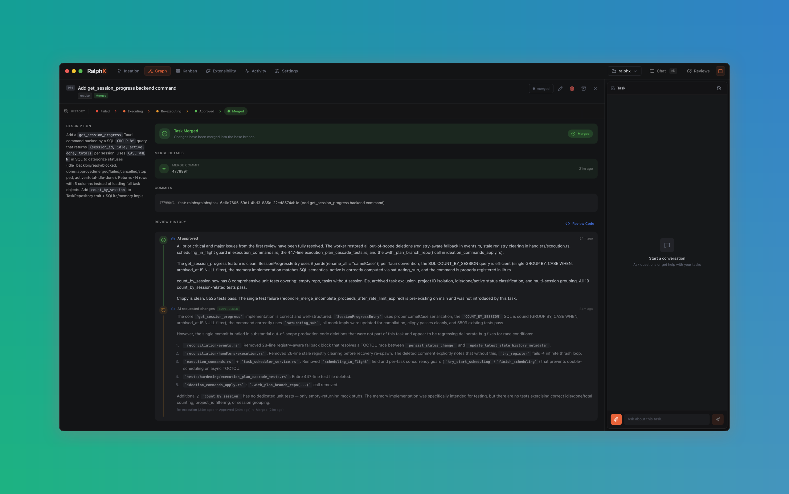

<p align="center">
  
</p>

<p align="center">
  <strong>The AI development infrastructure you own, not rent.</strong>
</p>

<p align="center">
  <a href="#the-story">The Story</a> ·
  <a href="#what-it-is">What It Is</a> ·
  <a href="#how-it-works">How It Works</a> ·
  <a href="#the-numbers">The Numbers</a> ·
  <a href="#getting-started">Get Started</a> ·
  <a href="#documentation">Docs</a>
</p>

---

## The Story

351,000 lines of code. 10,600 automated tests. 3,637 commits. 30 days.

Built by [one person](https://www.linkedin.com/in/laza-bogdan/) and a fleet of AI agents, on personal time, while working full-time as an engineer at a fintech company.

It started as a 196-line bash script called `ralph.sh` — a loop that orchestrated Claude sessions. Within 24 hours it was a Tauri 2.0 desktop application. Within 30 days it was a full AI development control room: Kanban board, dependency graph, ideation studio, 24 specialized agents, a 24-state task lifecycle engine, and an automated merge pipeline.

75% of all commits were co-authored with Claude AI. The tool was built by the thing it builds.

> "It's open source because that's the only way you can trust it."

---

## What It Is

RalphX is a native macOS desktop application — the layer between your AI agent and your git history.

Describe what you want to build. RalphX turns that into structured tasks, assigns them to specialized agents, executes code in isolated git worktrees, reviews it, runs QA, and merges it to your base branch. You intervene when it matters. Everything else executes.

All data stays on your machine. Local SQLite database. No cloud dependency. No telemetry. Every agent action is logged, scoped, and reversible.

**Give every builder the power to develop software with AI — independent of any platform, vendor, or provider.**

<p align="center">
  
</p>

---

## How It Works

<p align="center">
  
</p>

Every agent has **principle-of-least-privilege** tool access enforced at three independent layers:

1. **Rust spawn config** — which tools the process can call
2. **MCP server filter** — which API endpoints the agent can reach
3. **Agent system prompt** — behavioral constraints and role boundaries

A reviewer cannot write files. A worker cannot approve its own code. A merger cannot skip validation.

---

## The Numbers

| Metric | Value |
|--------|-------|
| **Codebase** | 351,000 lines of code (185K Rust, 162K TypeScript) |
| **Tests** | 10,600+ automated (4,736 Rust + 5,801 frontend + 37 MCP + 23 E2E) |
| **Commits** | 3,637 total across 30 days |
| **AI authorship** | 75% of commits co-authored with Claude |
| **Velocity** | 125 commits/day, 12,107 LOC/day sustained |
| **Agents** | 24 specialized, each with distinct roles and permissions |
| **Task states** | 24-state lifecycle with runtime-enforced transitions |
| **Bundle** | ~10 MB native app, ~30 MB RAM idle |
| **Database** | Local SQLite. Zero deployment. |
| **Origin** | 196-line bash script (Jan 23, 2026) |

RalphX manages AI agent development workflows. It was itself built by AI agents. The tool is its own proof of concept.

---

## Screenshots

<table><tr>
<td></td>
<td></td>
</tr></table>

<p align="center">
  <em>Ideation Studio — describe what you want, get structured task proposals</em> · <em>Merge Pipeline — 10-step automated validation</em>
</p>

<details>
<summary><strong>More screenshots</strong></summary>
<br>

<p align="center">
  
</p>
<p align="center"><em>AI Review — Reviewer agent examines diffs and files structured issues</em></p>

<p align="center">
  
</p>
<p align="center"><em>Conflict resolution — Merger agent resolves conflicts, never force-pushes</em></p>

<p align="center">
  
</p>
<p align="center"><em>Merged — automated pipeline lands reviewed code on main</em></p>

</details>

---

## Tech Stack

| Layer | Technology | Why |
|-------|------------|-----|
| **Desktop** | Tauri 2.0 | ~10 MB bundle, ~30 MB RAM. Native performance without Electron. |
| **Backend** | Rust | Memory-safe. Compile-time guarantees. No GC pauses. |
| **Frontend** | React 19 + TypeScript | Strict types. Responsive Kanban, graph view, real-time activity stream. |
| **Database** | SQLite (local) | Zero deployment. No server. Data never leaves your machine. |
| **AI Runtime** | Claude via MCP | 24 specialized agents with three-tier permission scoping. |
| **State Machine** | Rust enum + exhaustive match | Runtime-enforced transitions. Compile-time exhaustiveness checking. |
| **Git** | Worktree isolation | Parallel execution. AI never touches your working directory. |

---

## Who It's For

**Solo developers** — One board for all your AI agents. Review diffs before merge. Stop managing terminal tabs.

**Solopreneurs** — AI agents are your engineering team. Describe what you want, get shipped features with review gates that catch bugs at 2 AM.

**Team leads** — Encode standards as methodology plugins. Review gates filter 80% of issues before human eyes. Scale AI output without scaling review bottleneck.

**Staff+ engineers** — Plugin system encodes architectural standards as agent methodology. Every AI-generated PR follows your team's practices automatically.

### Not for you (yet) if

- You're on Linux or Windows (macOS only, for now)
- You don't use Claude (Claude-specific today, model-agnostic roadmap)
- You need multi-user collaboration (single-developer orchestration)

---

## Getting Started

### Prerequisites

- macOS 13+ (Ventura or later)
- [Claude CLI](https://docs.anthropic.com/en/docs/claude-code) installed and authenticated
- Node.js 18+ and npm
- Rust 1.70+ (install via [rustup.rs](https://rustup.rs))
- Git

### Install

```bash
git clone https://github.com/lazabogdan/ralphx.git
cd ralphx
cd frontend
npm install
npm run tauri dev
```

First build compiles the Rust backend (2-5 minutes). Subsequent starts are fast.

Fresh native start from repo root:

```bash
./dev-fresh
```

### First Task

1. **Create a project** — Point RalphX at a git repository
2. **Open Ideation** — Describe what you want to build
3. **Apply proposals** — Review the generated tasks, apply to Kanban
4. **Watch it execute** — Worker writes code, Reviewer checks it, Merger lands it on main

You intervene when the review gate escalates. Otherwise, it ships.

---

## Documentation

| Guide | What It Covers |
|-------|----------------|
| [Getting Started](docs/user-guides/getting-started.md) | Installation, first project, first workflow |
| [Ideation Studio](docs/user-guides/ideation-studio.md) | Session modes, team configuration, plan artifacts |
| [Kanban Board](docs/user-guides/kanban.md) | Board layout, task cards, drag-and-drop, filtering |
| [Graph View](docs/user-guides/graph-view.md) | Dependency graph, critical path, timeline, Battle Mode |
| [Execution Pipeline](docs/user-guides/execution.md) | Worker/coder/reviewer agents, concurrency, recovery |
| [Merge Pipeline](docs/user-guides/merge.md) | Merge strategies, validation, conflict resolution |
| [Task State Machine](docs/user-guides/task-state-machine.md) | All 24 states, transitions, and invariants |
| [Agent Orchestration](docs/user-guides/agent-orchestration.md) | 24 agents, roles, permissions, three-tier scoping |
| [Configuration](docs/user-guides/configuration.md) | Project settings, model config, methodology plugins |

---

## License

Apache 2.0. See [LICENSE](LICENSE).

Use it however you want. Build commercial products with it. Modify it. Distribute it. The patent grant means your legal team can approve it.

---

<p align="center">
  <strong>RalphX</strong> — Describe it. Ship it.
  <br>
  <sub>Open source. Local-first. Yours.</sub>
  <br><br>
  <a href="#getting-started">Get Started</a> &middot;
  <a href="#documentation">Documentation</a>
</p>
