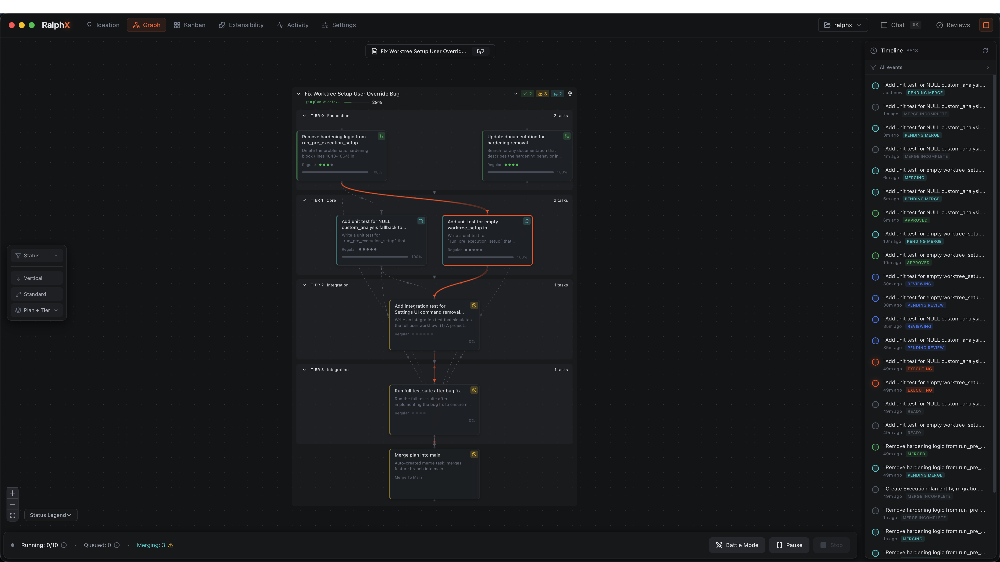
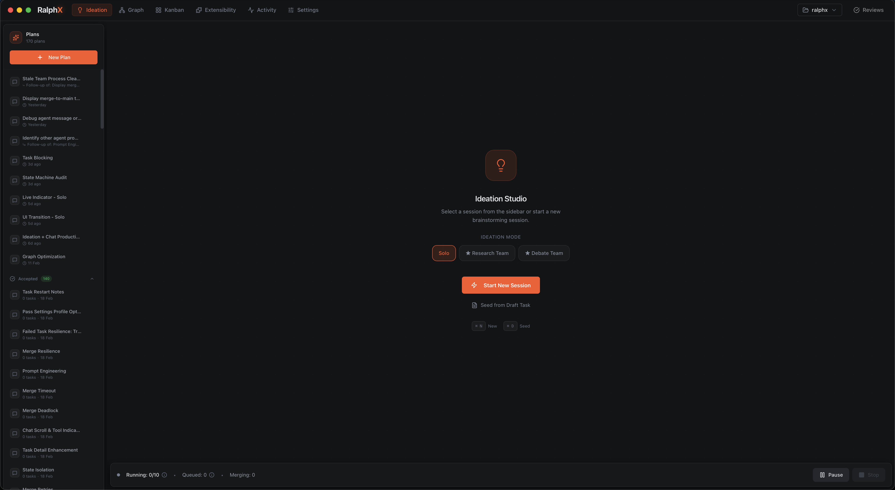
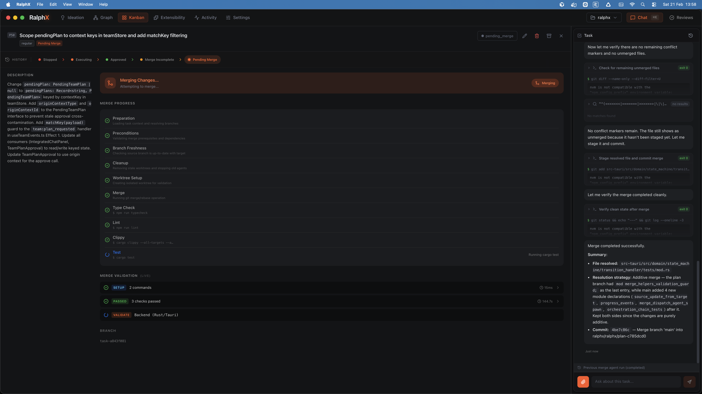
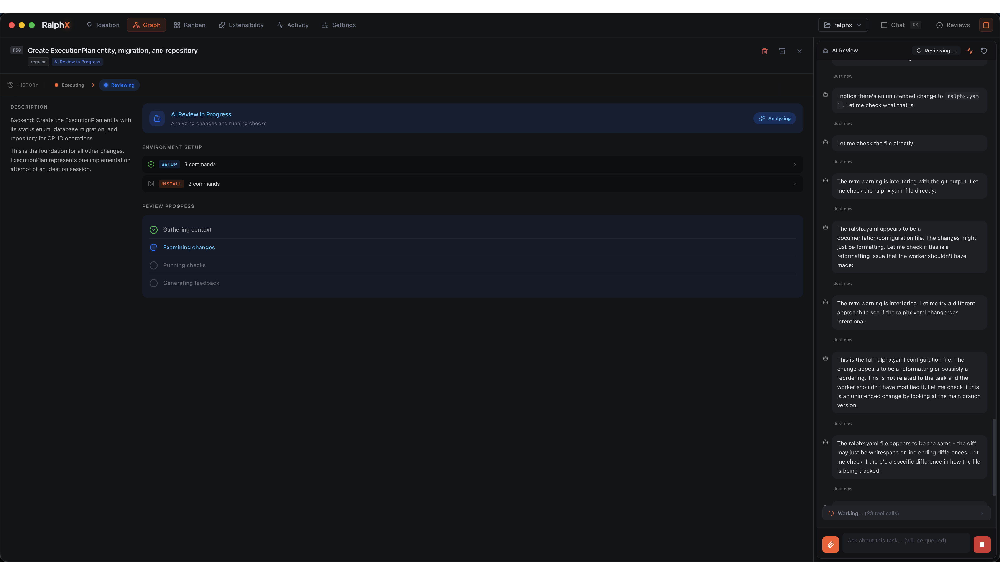
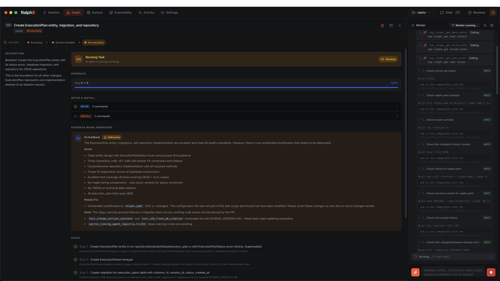
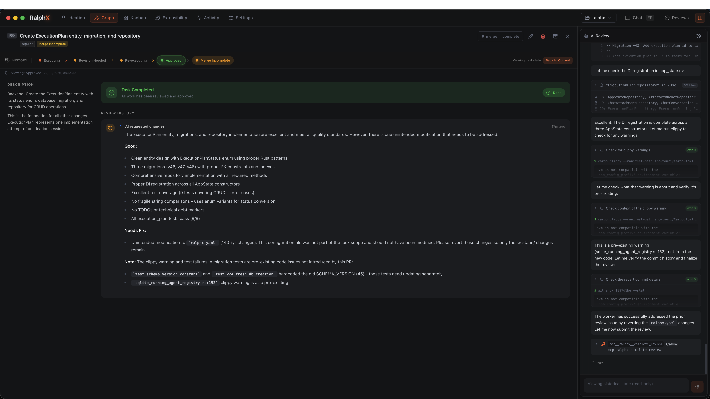
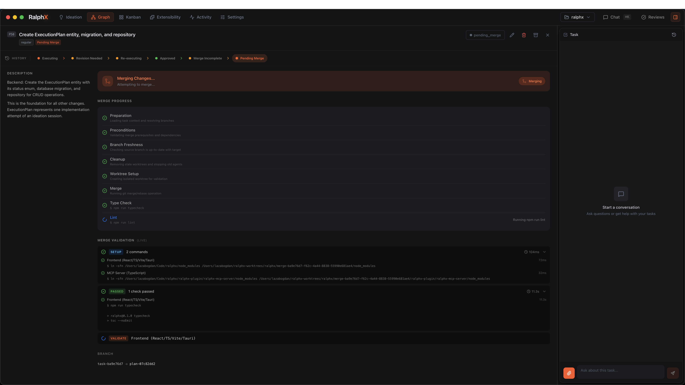
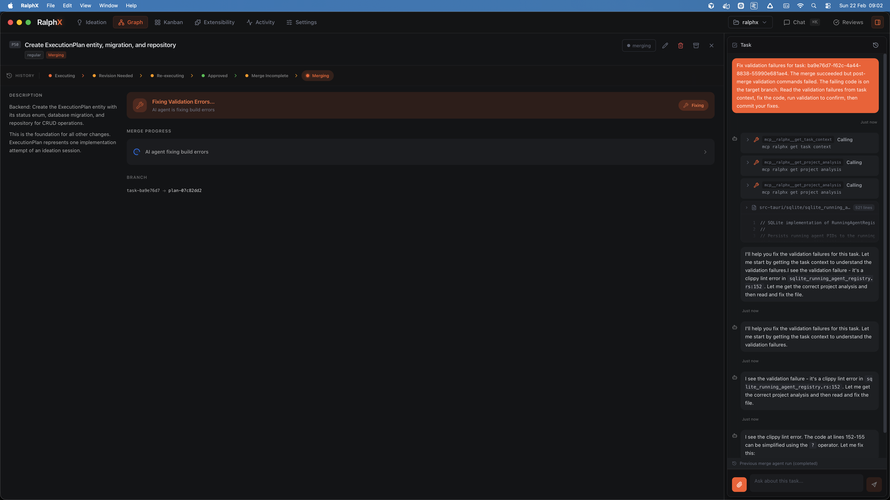
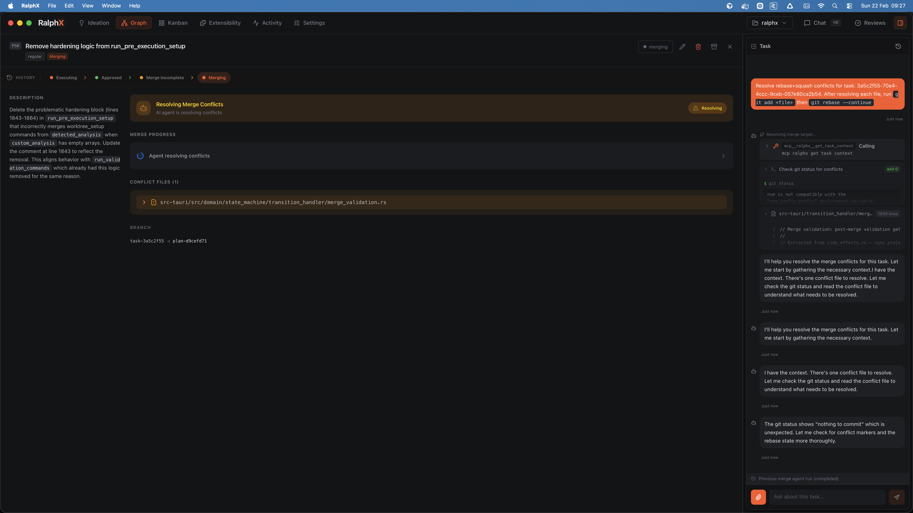
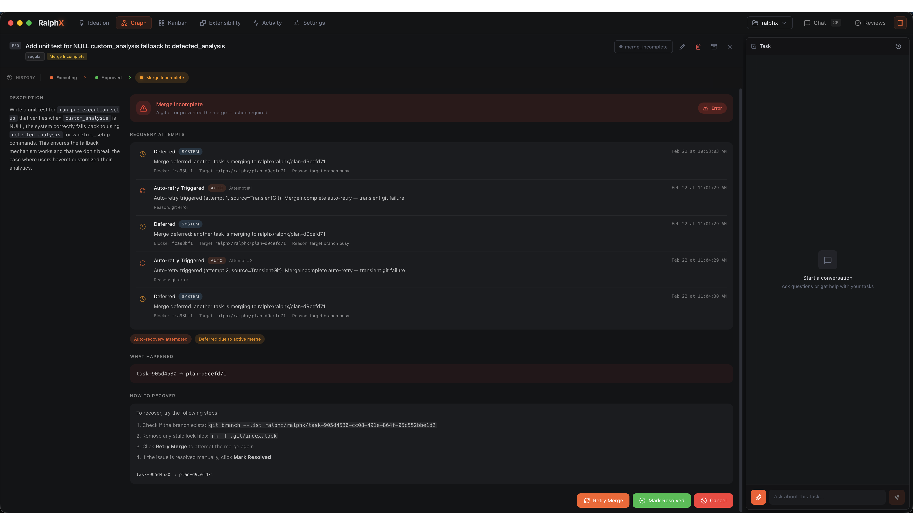

<h1 align="center">
  <br>
  RalphX
  <br>
</h1>

<p align="center">
  <strong>Describe it. Ship it.</strong>
  <br>
  The AI development infrastructure you own, not rent.
</p>

<p align="center">
  <a href="#the-story">The Story</a> &middot;
  <a href="#what-it-is">What It Is</a> &middot;
  <a href="#screenshots">Screenshots</a> &middot;
  <a href="#how-it-works">How It Works</a> &middot;
  <a href="#the-numbers">The Numbers</a> &middot;
  <a href="#who-its-for">Who It's For</a> &middot;
  <a href="#getting-started">Get Started</a> &middot;
  <a href="#documentation">Docs</a>
</p>

---

## The Story

351,000 lines of code. 10,600 automated tests. 3,637 commits. 30 days.

Built by one person and a fleet of AI agents, on personal time, while working full-time as an engineer at a fintech company.

It started as a 196-line bash script called `ralph.sh` — a loop that orchestrated Claude sessions. Within 24 hours it was a Tauri 2.0 desktop application. Within 30 days it was a full AI development control room: Kanban board, dependency graph, ideation studio, 24 specialized agents, a 24-state task lifecycle engine, and an automated merge pipeline.

75% of all commits were co-authored with Claude AI. The tool was built by the thing it builds.

> "It's open source because that's the only way you can trust it."

---

<p align="center">
  
</p>

---

## What It Is

RalphX is a native macOS desktop application — the layer between your AI agent and your git history.

Describe what you want to build. RalphX turns that into structured tasks, assigns them to specialized agents, executes code in isolated git worktrees, reviews it, runs QA, and merges it to your base branch. You intervene when it matters. Everything else executes.

All data stays on your machine. Local SQLite database. No cloud dependency. No telemetry. Every agent action is logged, scoped, and reversible.

**Give every builder the power to develop software with AI — independent of any platform, vendor, or provider.**

---

## Screenshots

<table>
  <tr>
    <td width="50%">
      
      <p><strong>Ideation Studio</strong> — Describe what you want in natural language. Choose Solo, Research Team, or Debate Team mode. Get task proposals with dependencies, complexity estimates, and acceptance criteria. Apply to Kanban with one click.</p>
    </td>
    <td width="50%">
      
      <p><strong>Merge Pipeline</strong> — 10-step automated merge validation: preparation, preconditions, branch freshness, worktree setup, cleanup, merge, type check, lint, clippy, tests. The Merger agent resolves conflicts and reports results in real time.</p>
    </td>
  </tr>
</table>

---

#### Review Gates

<table>
  <tr>
    <td width="33%">
      
      <p><strong>AI Review</strong> — The Reviewer agent examines diffs, runs environment checks, and steps through changes in real time. Code is analyzed before feedback reaches the Worker.</p>
    </td>
    <td width="33%">
      
      <p><strong>Revision cycle</strong> — Structured feedback: specific issues, severity grades, required fixes. The Worker gets exactly what it needs to correct. Max 3 cycles before human escalation.</p>
    </td>
    <td width="33%">
      
      <p><strong>Approved</strong> — Code passes AI review and moves to merge. Human escalation happens when it matters — not by default.</p>
    </td>
  </tr>
</table>

---

#### Merge Pipeline

<table>
  <tr>
    <td width="50%">
      
      <p><strong>Queued</strong> — Merge starts automatically. Type check, lint, clippy, and tests run in sequence. Failures are visible immediately.</p>
    </td>
    <td width="50%">
      
      <p><strong>Validation failure</strong> — Build errors are fixed inline by the Merger agent. The merge branch isn't reverted.</p>
    </td>
  </tr>
  <tr>
    <td width="50%">
      
      <p><strong>Conflicts</strong> — The Merger agent resolves conflicts, reports what changed, and never force-pushes. Your history stays clean.</p>
    </td>
    <td width="50%">
      
      <p><strong>Deferred</strong> — Blocked merges defer automatically with a timestamped recovery log. Retry, resolve manually, or cancel — you stay in control.</p>
    </td>
  </tr>
</table>

---

## How It Works

```
 You describe what you want
  |
  v
+-----------+
| Ideation  |  Natural language --> task proposals with dependencies
| Studio    |  Solo, Research Team, or Debate Team mode
+-----+-----+
      |
      v
+-----------+
|  Kanban   |  Drag task to Planned --> execution begins
|  Board    |  Up to 10 tasks running concurrently
+-----+-----+
      |
      v
+-----------+  Writes code in isolated git worktree
|  Worker   |  Scoped tools: file read/write, shell
|  Agent    |  Cannot approve its own code
+-----+-----+
      |
      v
+-----------+  Reviews diffs, files structured issues
| Reviewer  |  File read + validation commands + verdict
|  Agent    |  Max 3 auto-fix cycles before escalation
+-----+-----+
      |
      v
+-----------+  Merges to main, runs full validation suite
|  Merger   |  Type check -> lint -> clippy -> tests
|  Agent    |  Reports conflicts, never forces
+-----+-----+
      |
      v
+-----------+  Detects loops, stalls, resource waste
|Supervisor |  Stops stuck agents via state machine
| Watchdog  |  Escalates to you when it matters
+-----------+
```

Every agent has **principle-of-least-privilege** tool access enforced at three independent layers:

1. **Rust spawn config** — which tools the process can call
2. **MCP server filter** — which API endpoints the agent can reach
3. **Agent system prompt** — behavioral constraints and role boundaries

A reviewer cannot write files. A worker cannot approve its own code. A merger cannot skip validation.

---

## The Numbers

| Metric | Value |
|--------|-------|
| **Codebase** | 351,000 lines of code (185K Rust, 162K TypeScript) |
| **Tests** | 10,600+ automated (4,736 Rust + 5,801 frontend + 37 MCP + 23 E2E) |
| **Commits** | 3,637 total across 30 days |
| **AI authorship** | 75% of commits co-authored with Claude |
| **Velocity** | 125 commits/day, 12,107 LOC/day sustained |
| **Agents** | 24 specialized, each with distinct roles and permissions |
| **Task states** | 24-state lifecycle with runtime-enforced transitions |
| **Bundle** | ~10 MB native app, ~30 MB RAM idle |
| **Database** | Local SQLite. Zero deployment. |
| **Origin** | 196-line bash script (Jan 23, 2026) |

RalphX manages AI agent development workflows. It was itself built by AI agents. The tool is its own proof of concept.

---

## Key Features

### Kanban + Auto-Execution

A visual board where columns map to lifecycle states. Drag a task to **Planned** and a Worker agent picks it up, writes code in an isolated worktree, and pushes it through the full pipeline. The Kanban board is the interface; the agents are the engine.

### 24-State Task Lifecycle

Every task moves through a structured lifecycle enforced by a runtime state machine with compile-time exhaustive match checking. Invalid transitions are rejected immediately. States span from Backlog through Executing, Reviewing, QA, Merging, and Done. Every transition is logged with timestamps, agent IDs, and outcomes.

### Ideation Studio

Open Ideation. Describe what you want to build. The Orchestrator agent researches your codebase and generates task proposals with dependency graphs, complexity estimates, acceptance criteria, and execution order. Choose **Solo** mode for quick tasks, **Research Team** for investigation, or **Debate Team** for architectural decisions. Apply proposals to the Kanban board with one click.

### Review Gates

AI-generated code never ships unreviewed:

1. **AI Review** — Reviewer agent examines diffs, files structured issues with severity levels
2. **Human Checkpoint** — Escalation point for changes that need your judgment
3. **QA Testing** — Automated test execution and verification
4. **Auto-fix limit** — Max 3 auto-fix cycles. If the Worker can't resolve review issues, it stops and escalates.

### Git Worktree Isolation

Every task gets its own git worktree. AI agents commit, branch, and merge in complete isolation — your working directory is never touched. Review diffs before anything reaches main. If something goes wrong, the worktree is disposable. Your code is safe.

### Dependency Graph

Interactive node graph with critical path highlighting, tier-based grouping, and real-time execution status. See what's blocked, what's running, and what's on the longest chain. Battle Mode renders executing tasks as a pixel-art space game — same real data, different view.

### Supervisor Watchdog

A background process monitors all running tasks. Detects execution loops, stalled agents, and resource waste. When it detects a problem, it stops the stuck agent through the state machine and escalates to you. No more checking terminal tabs wondering if the AI is still thinking.

### Plugin System + Memory

Encode your team's practices as reusable methodology plugins — review criteria, coding patterns, testing requirements. Agents follow your standards automatically. The memory system captures context across sessions so agents learn your codebase conventions over time.

---

## Tech Stack

| Layer | Technology | Why |
|-------|------------|-----|
| **Desktop** | Tauri 2.0 | ~10 MB bundle, ~30 MB RAM. Native performance without Electron. |
| **Backend** | Rust | Memory-safe. Compile-time guarantees. No GC pauses. |
| **Frontend** | React 19 + TypeScript | Strict types. Responsive Kanban, graph view, real-time activity stream. |
| **Database** | SQLite (local) | Zero deployment. No server. Data never leaves your machine. |
| **AI Runtime** | Claude via MCP | 24 specialized agents with three-tier permission scoping. |
| **State Machine** | Rust enum + exhaustive match | Runtime-enforced transitions. Compile-time exhaustiveness checking. |
| **Git** | Worktree isolation | Parallel execution. AI never touches your working directory. |

---

## Who It's For

### Individual

**Senior Software Engineer** — Running 3+ AI sessions in terminal tabs. Copy-pasting context. Managing worktrees manually. RalphX gives you one board, live visibility into every agent, and review diffs before merge.

**Solopreneur** — AI agents are your entire engineering team. RalphX turns "describe what I want" into shipped features — with review gates that catch bugs at 2 AM.

**Vibe Coder** — You build by describing what you want. Maybe you're a designer, PM, or domain expert coding through AI. The 24-state lifecycle and review gates protect you from shipping broken code. The AI reviews the AI — and escalates when it matters.

### Team

**Staff / Principal Engineer** — The plugin system lets you encode architectural standards as agent methodology — review criteria, coding patterns, testing requirements. Every AI-generated PR follows your team's practices automatically.

**Tech Lead** — Your team's AI output exceeds your review capacity. Review gates filter 80% of issues before your eyes touch the code. Review what matters.

### Organization

**Engineering Manager** — Visibility into AI-assisted development without micromanaging. Activity stream and state machine give a real-time dashboard: what's executing, what's blocked, what shipped.

**Director of Engineering** — Standardize AI development practices across teams. One methodology configuration, enforced everywhere. Audit trail satisfies security. Open source means they audit the actual code.

### Enterprise

**VP Engineering** — Turn "we're experimenting with AI coding" into "we have a structured, auditable AI development pipeline."

**CTO** — Local-first data sovereignty. Open source, no vendor lock-in. Rust backend, memory-safe. Runtime-enforced state machine. Your security team can audit it in weeks, not months.

### Not For You If

- You're on Linux or Windows (macOS only, for now)
- You prefer cloud-hosted AI dev platforms (RalphX is local-first)
- You need multi-user real-time collaboration (single-developer orchestration today)
- You don't use Claude (RalphX orchestrates Claude agents specifically)
- You work from NFS or network-attached filesystems (git worktrees require local storage)
- You want code autocomplete (that's Copilot / Cursor — RalphX works outside the IDE)

---

## Getting Started

### Prerequisites

- macOS 13+ (Ventura or later)
- [Claude CLI](https://docs.anthropic.com/en/docs/claude-code) installed and authenticated
- Node.js 18+ and npm
- Rust 1.70+ (install via [rustup.rs](https://rustup.rs))
- Git

### Install

```bash
git clone https://github.com/lazabogdan/ralphx.git
cd ralphx
npm install
npm run tauri dev
```

First build compiles the Rust backend (2-5 minutes). Subsequent starts are fast.

### First Task

1. **Create a project** — Point RalphX at a git repository
2. **Open Ideation** — Describe what you want to build
3. **Apply proposals** — Review the generated tasks, apply to Kanban
4. **Watch it execute** — Worker writes code, Reviewer checks it, Merger lands it on main

You intervene when the review gate escalates. Otherwise, it ships.

---

## Documentation

| Guide | What It Covers |
|-------|----------------|
| [Getting Started](docs/user-guides/getting-started.md) | Installation, first project, first workflow |
| [Ideation Studio](docs/user-guides/ideation-studio.md) | Session modes, team configuration, plan artifacts |
| [Kanban Board](docs/user-guides/kanban.md) | Board layout, task cards, drag-and-drop, filtering |
| [Graph View](docs/user-guides/graph-view.md) | Dependency graph, critical path, timeline, Battle Mode |
| [Execution Pipeline](docs/user-guides/execution.md) | Worker/coder/reviewer agents, concurrency, recovery |
| [Merge Pipeline](docs/user-guides/merge.md) | Merge strategies, validation, conflict resolution |
| [Task State Machine](docs/user-guides/task-state-machine.md) | All 24 states, transitions, and invariants |
| [Agent Orchestration](docs/user-guides/agent-orchestration.md) | 24 agents, roles, permissions, three-tier scoping |
| [Configuration](docs/user-guides/configuration.md) | Project settings, model config, methodology plugins |

---

## License

Apache 2.0. See [LICENSE](LICENSE).

Use it however you want. Build commercial products with it. Modify it. Distribute it. The patent grant means your legal team can approve it.

---

<p align="center">
  <strong>RalphX</strong> — Describe it. Ship it.
  <br>
  <sub>Open source. Local-first. Yours.</sub>
  <br><br>
  <a href="#getting-started">Get Started</a> &middot;
  <a href="#documentation">Documentation</a>
</p>
